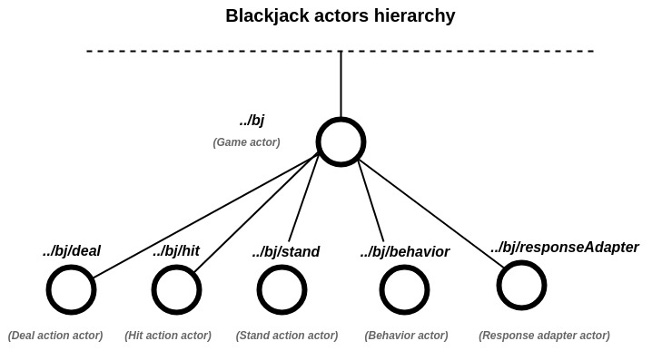
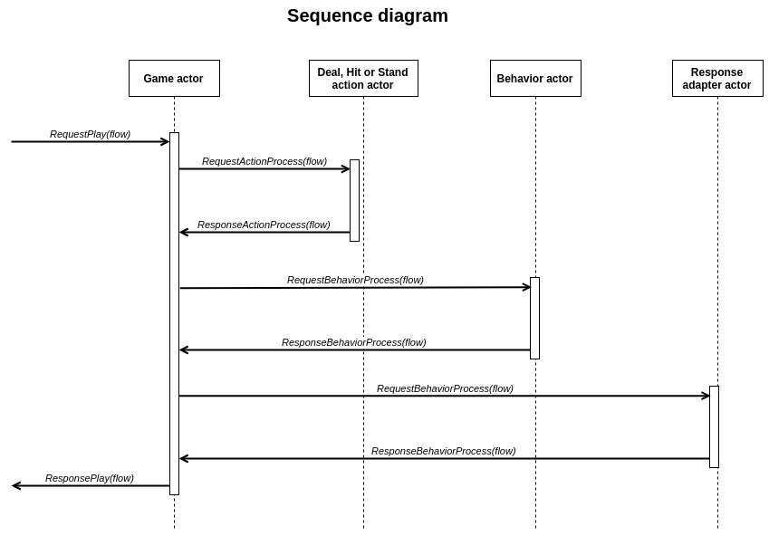

## One seat Blackjack card game implementation based on Scala Akka actors

# Supports three basic actions:

* Deal
* Hit
* Stand

# Allows to configure:

* Deck count
* Cut card position
* Dealer stand value
* Dealer soft value
* Default payout multiplier
* Blackjack payout multiplier

 
 

##

 
 

##

